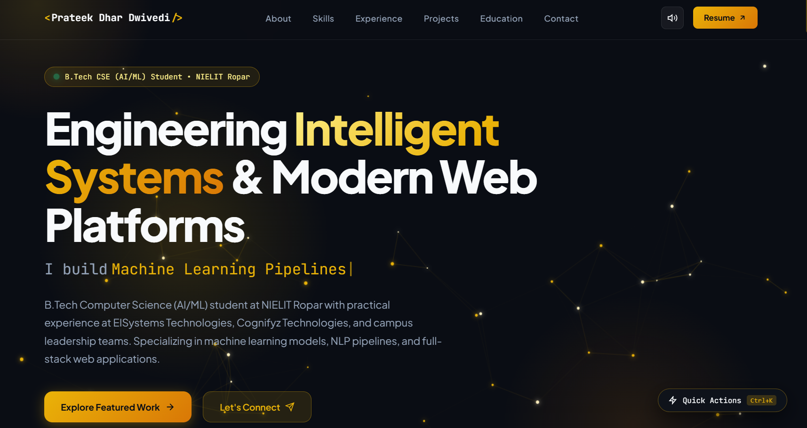

<div align="center">

# ⚡ Prateek Dhar Dwivedi — Portfolio

**A modern, interactive developer portfolio built with vanilla HTML5, CSS Design Tokens & JavaScript**

[](https://prateek-dhar-dwivedi.github.io/-Portfolio/)
[](https://github.com/Prateek-Dhar-Dwivedi/-Portfolio)
[](https://linkedin.com/in/prateek-dhar-dwivedi)
[](https://medium.com/@prateekdhardwivedi)

<br/>



</div>

---

## 📋 Table of Contents

- [About](#-about)
- [Features](#-features)
- [Tech Stack](#-tech-stack)
- [Sections](#-sections)
- [Project Structure](#-project-structure)
- [Getting Started](#-getting-started)
- [Deployment](#-deployment)
- [License](#-license)
- [Contact](#-contact)

---

## 🧑‍💻 About

This is the personal portfolio website of **Prateek Dhar Dwivedi** — a B.Tech Computer Science (AI/ML) student at NIELIT Ropar (Deemed to be University). The site showcases my projects, skills, experience, certifications, testimonials, and latest insights from Medium — all built from scratch using zero frameworks.

> **Design Philosophy:** Warm Golden-Amber design system on an obsidian dark background, with glassmorphism cards, neural particle physics canvas, and smooth micro-interactions throughout.

---

## ✨ Features

| Feature | Description |
|---|---|
| 🧠 **Neural Canvas** | Interactive particle physics simulation with signal pulses, gravity, and mouse-reactive connections |
| ⌨️ **Typing Effect** | Smooth typing animation cycling through specializations |
| ⚡ **Command Palette** | VS Code–style `Ctrl+K` quick actions for instant section navigation |
| 🔍 **Skill Search** | Real-time filter/search across 25+ technical skills |
| 📊 **Animated Stats** | Counter animations triggered by Intersection Observer |
| 🎠 **Testimonial Slider** | Touch-enabled carousel with autoplay and pagination dots |
| 📰 **Medium Insights** | Live RSS feed integration pulling latest articles from Medium |
| 🔝 **Scroll to Top** | Smooth scroll-to-top button with show/hide on scroll |
| 🎯 **Project Modals** | Deep-dive dialog modals for each featured project |
| 📱 **Fully Responsive** | Mobile-first design with breakpoints at 1024px, 768px, 480px, and 360px |
| 🌐 **Tech Marquee** | Auto-scrolling ticker displaying tech stack icons |
| 🎨 **CSS Design Tokens** | Full custom property system for colors, typography, spacing, and transitions |
| ✉️ **Contact Form** | FormSubmit-powered form with validation — no backend required |
| 🖱️ **Custom Cursor Glow** | Ambient cursor-following glow effect |

---

## 🛠️ Tech Stack

| Layer | Technologies |
|---|---|
| **Markup** | HTML5, Semantic Elements, `<dialog>`, SVG Icons |
| **Styling** | Vanilla CSS3, CSS Custom Properties (Design Tokens), Glassmorphism, CSS Grid, Flexbox |
| **Scripting** | Vanilla JavaScript (ES6+), Canvas API, Intersection Observer, Fetch API |
| **Fonts** | [Plus Jakarta Sans](https://fonts.google.com/specimen/Plus+Jakarta+Sans), [JetBrains Mono](https://fonts.google.com/specimen/JetBrains+Mono) |
| **Icons** | [Devicons](https://devicon.dev/), Custom SVG |
| **Form Backend** | [FormSubmit](https://formsubmit.co/) |
| **RSS Integration** | [rss2json API](https://rss2json.com/) → Medium feed |
| **Hosting** | GitHub Pages |

---

## 📑 Sections

1. **Hero** — Headline, typing animation, stats cards, tech marquee
2. **About** — Profile photo, bio, highlight cards, tech badges
3. **Skills** — Searchable 4-category grid (AI/ML, Full-Stack, Core Programming, Databases & Cloud)
4. **Experience** — Interactive timeline with 6 entries (internships, campus roles, academics)
5. **Projects** — Filterable project grid with 6 projects and deep-dive modals
   - TruthLens AI · Cineora · Velora · NIELIT MERN · NIELIT Python · Personal Portfolio
6. **Education & Certifications** — Degree card + 8 certification/hackathon cards
7. **Testimonials** — 9-slide carousel with endorsements from scientists, mentors, and peers
8. **Latest Insights** — Live Medium articles fetched via RSS with thumbnails, tags, and read time
9. **Contact** — Email, phone, location, social links, and FormSubmit contact form

---

## 📁 Project Structure

```
-Portfolio/
├── index.html          # Main HTML document (1350+ lines)
├── style.css           # Complete design system & styles (3900+ lines)
├── main.js             # All interactive JavaScript (900+ lines)
└── assets/
    ├── logo_clean.png  # Favicon & nav logo
    ├── profile.jpg     # Profile photo
    ├── resume.pdf      # Downloadable resume
    ├── *_real.png      # Project screenshots (6)
    └── *.jpg           # Testimonial avatars (8)
```

---

## 🚀 Getting Started

### Prerequisites

Any modern web browser and a local HTTP server (to avoid CORS issues with the Medium RSS fetch).

### Run Locally

```bash
# Clone the repository
git clone https://github.com/Prateek-Dhar-Dwivedi/-Portfolio.git
cd -Portfolio

# Serve with Python
python -m http.server 3000

# Or serve with Node.js
npx serve -l 3000
```

Then open **http://localhost:3000** in your browser.

### Quick Edits

| What to change | Where |
|---|---|
| Personal info, links, projects | `index.html` |
| Colors, spacing, typography | CSS Custom Properties in `:root` (`style.css` lines 8–46) |
| Typing words, project modal data | `main.js` |
| Medium username | `MEDIUM_USERNAME` in `initMediumInsights()` (`main.js`) |

---

## 🌐 Deployment

This portfolio is deployed on **GitHub Pages** from the `main` branch.

**Live URL:** [prateek-dhar-dwivedi.github.io/-Portfolio/](https://prateek-dhar-dwivedi.github.io/-Portfolio/)

Any push to `main` automatically triggers a new deployment.

---

## 📬 Contact

| Channel | Link |
|---|---|
| 🌐 Portfolio | [prateek-dhar-dwivedi.github.io/-Portfolio](https://prateek-dhar-dwivedi.github.io/-Portfolio/) |
| 💼 LinkedIn | [linkedin.com/in/prateek-dhar-dwivedi](https://linkedin.com/in/prateek-dhar-dwivedi) |
| 🐙 GitHub | [github.com/Prateek-Dhar-Dwivedi](https://github.com/Prateek-Dhar-Dwivedi) |
| ✍️ Medium | [medium.com/@prateekdhardwivedi](https://medium.com/@prateekdhardwivedi) |
| 🐦 Twitter / X | [x.com/prateekdhard](https://twitter.com/prateekdhard) |
| 📧 Email | [prateekdhardwivedi4@gmail.com](mailto:prateekdhardwivedi4@gmail.com) |

---

<div align="center">

**© 2026 Prateek Dhar Dwivedi · Built with HTML5, Vanilla CSS & JavaScript**

⭐ Star this repo if you found it useful!

</div>
